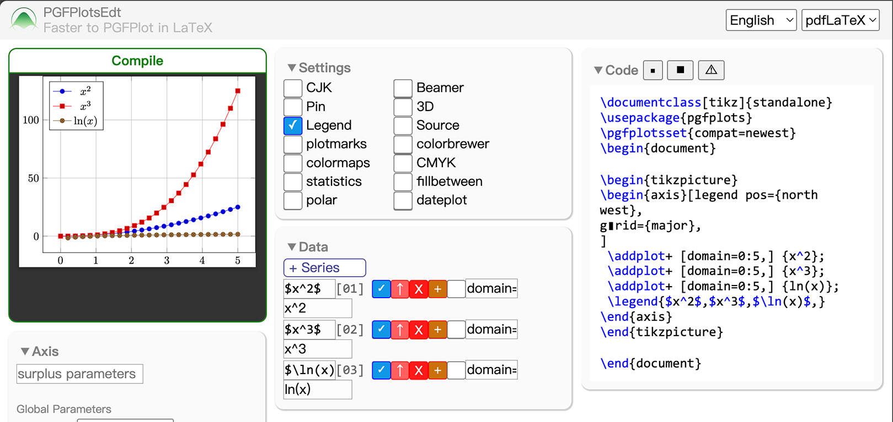
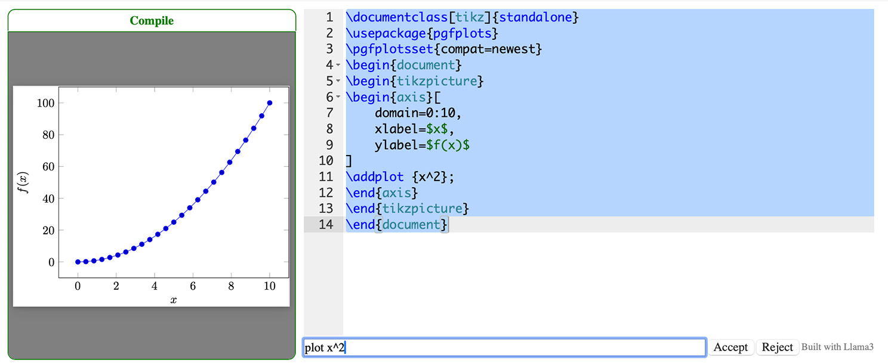

## PGFPlotsEdt - Faster to PGFPlot in LaTeX
### A PGFPlots Statistic Graph Interactive Editor.

<a href="https://logcreative.github.io/PGFPlotsEdt/index.html?lang=en"></a>
<a href="https://logcreative.tech/PGFPlotsEdt/index.html?lang=chs"></a>
<a href="https://github.com/LogCreative/PGFPlotsEdt/releases"></a>
<a href="https://github.com/LogCreative/PGFPlotsEdt/blob/master/LICENSE"></a>
<a href="https://github.com/LogCreative/PGFPlotsEdt/commits/master"></a>
<a href="https://logcreative.github.io/LaTeXSparkle/"></a>

#### Introduction

PGFPlots is a remarkable package in LaTeX, to create precise, vectorized, and highly personalized statistic graphs. You could get more information about PGFPlots package on https://github.com/pgf-tikz/pgfplots, thank all those contributors for creating a useful package to plot in LaTeX natively.

PGFPlotsEdt is basically a frontend for this package, to generate PGFPlots code automatically through a web-based user interface. This project is under [LaTeX Sparkle Project](https://logcreative.github.io/LaTeXSparkle/), you could also get some tips on PGFPlots on [this webpage](https://logcreative.github.io/LaTeXSparkle/src/art/chapter06.html).

TikzEdt is the inspiration of this project, to create LaTeX TikZ graph in WYSIWYG (what you see is what you get) mode. You could download this software on [TikzEdt homepage](http://www.tikzedt.org/), you could also get more tips on TikZEdt on [this webpage](https://logcreative.github.io/LaTeXSparkle/src/art/chapter04.html).

#### Usage

- **Online version** You could use the online version directly:

    <a href="https://logcreative.github.io/PGFPlotsEdt/">https://logcreative.github.io/PGFPlotsEdt/ </a>

    

- **Local version with faster compilation** If you want to make sure the data won't go anywhere in the Internet, or try to compile the document faster, use the offline version by downloading the repo and fire up a local server to handle the compling tasks:
    - Install TeX distribution on your local computer.
    - Install python and the dependencies by
    ```bash
    pip install flask
    ```
    - Start the server.
    ```bash
    python ppedt_server.py
    ```
    - Open `http://127.0.0.1:5678` in your browser.
    > For Windows users, the server side will automatically change the fontset used by CJK for a larger compatibility.

- **Local version supercharged by LLM** If you want to use LLM to supercharge your PGFPlotsEdt coding experience, use PGFPlotsEdt with LLM. It uses [Llama 3](https://llama.meta.com/llama3/) model deployed by [MLC](https://llm.mlc.ai), 6GB free VRAM is required (a typical supported device is a MacBook Pro).
    - Install [Anaconda](https://www.anaconda.com/download/success) first.
    - Use the commands to set the environment, you don't have to setup the environment repeatedly on later runs:
    ```bash
    conda env update -n ppedt -f ppedt_server_llm.yml
    ```
    - Use the commands to start the PGFPlotsEdt server with LLM:
    ```bash
    conda activate ppedt
    python ppedt_server_llm.py
    ```
    On the first run, the model will be downloaded, which takes some time and disk space. The Llama 3 model will be saved in a temporary folder (in `~/.cache/mlc_llm` directory) and the loading time will be much faster in the following runs.
    - Open `http://127.0.0.1:5678` in your browser, then press "Edit code manually" button (or just open `http://127.0.0.1:5678?code_only` directly). If there is a LLM toolbar at the bottom of the text editor, then LLM is ready to go.
    - If you want to terminate PGFPlotsEdt with LLM, input <kbd>CTRL</kbd><kbd>C</kbd> *twice* in the server console.

    

- **Deployment version** If you want to deploy the server in the LAN, use the deployment server in the directory [deploy/](deploy/), please follow the [LICENSE](LICENSE) for deployment:
    - If you are using *nix operating system for deployment, finish the configuration in **Local version with faster compilation** step, and `pip install gunicorn` to install the additional package. Then run the deployment server directly by:
    ```bash
    cd deploy
    python gunicorn-deploy.py
    ```
    - Or you could use [Docker](https://www.docker.com/products/docker-desktop/) for virtualization:
        - Use one of the pre-built images directly ([Docker Hub](https://hub.docker.com/repository/docker/logcreative/pgfplotsedt/tags) or [GitHub Packages](https://github.com/LogCreative/PGFPlotsEdt/pkgs/container/pgfplotsedt)):
        ```bash
        docker run logcreative/pgfplotsedt:master          # Docker Hub
        docker run ghcr.io/logcreative/pgfplotsedt:master  # GitHub Packages
        ```
        - Or you could build a docker container from the source:
        ```bash
        cd deploy
        docker-compose up --build
        ```
    - Then the deployment will be on `[IP]:5678`.


#### Acknowledgements

<a href="https://cn.vuejs.org/" target="_blank">Vue.js</a> is the progressive JavaScript framework for this project.

<a href="https://latexonline.cc/" target="_blank">LaTeXOnline</a> is the chosen online LaTeX compiler for previewing the graph result.

<a href="https://www.mathjax.org/" target="_blank">MathJax</a> is the TeX typeset rendering machine for previewing the formula input.

<a href="https://llama.meta.com/llama3/" target="_blank">Llama 3</a> is the chosen large language model to generate code. The LLM model is deployed by <a href="https://llm.mlc.ai" target="_blank">MLC LLM</a>.

>Copyright (c) 2020-2024 Log Creative & LaTeX Sparkle Project
