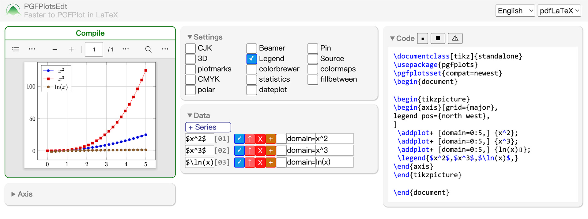
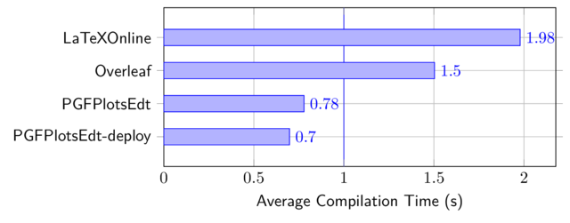
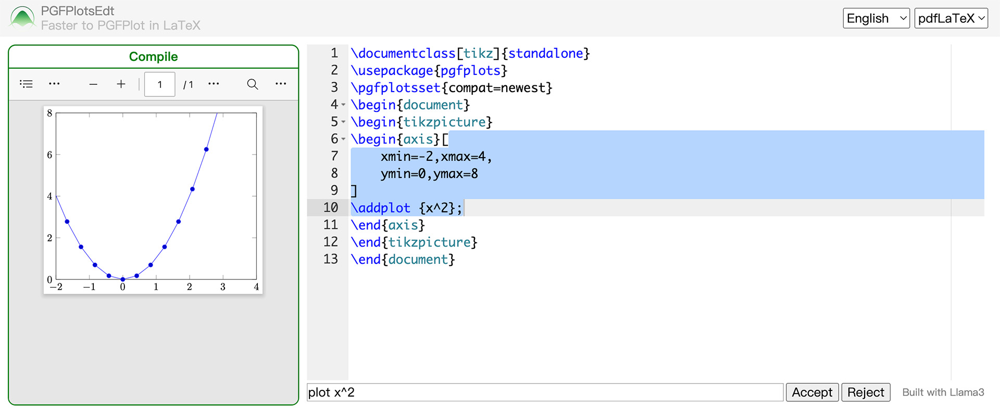

## PGFPlotsEdt - Faster to PGFPlot in LaTeX
### A PGFPlots Statistic Graph Interactive Editor.

[Online website](https://logcreative.github.io/PGFPlotsEdt/index.html) | [Documentation](https://logcreative.github.io/PGFPlotsEdt-doc/pgfplotsedt.pdf) | [Video](https://www.youtube.com/watch?v=SRZqbhqBcZY&list=PLLu4lSdFKgjXGxlWuPDG-g1sfzzidUrrV) | [网站(简体中文)](https://logcreative.tech/PGFPlotsEdt/index.html?lang=chs) | [文档(简体中文)](https://logcreative.tech/PGFPlotsEdt-doc/pgfplotsedt_chs.pdf) | [视频(简体中文)](https://www.bilibili.com/video/BV1f5ebeREet)

#### Introduction

PGFPlots is a remarkable package in LaTeX, to create precise, vectorized, and highly personalized statistic graphs. You could get more information about PGFPlots package on https://github.com/pgf-tikz/pgfplots, thank all those contributors for creating a useful package to plot in LaTeX natively.

PGFPlotsEdt is basically a frontend for this package, to generate PGFPlots code automatically through a web-based user interface. This project is under [LaTeX Sparkle Project](https://logcreative.github.io/LaTeXSparkle/), you could also get some tips on PGFPlots on [this webpage](https://logcreative.github.io/LaTeXSparkle/src/art/chapter06.html).

TikzEdt is the inspiration of this project, to create LaTeX TikZ graph in WYSIWYG (what you see is what you get) mode. You could download this software on [TikzEdt homepage](http://www.tikzedt.org/), you could also get more tips on TikZEdt on [this webpage](https://logcreative.github.io/LaTeXSparkle/src/art/chapter04.html).

#### Usage

- **Online version** You could use the online version directly:

    <a href="https://logcreative.github.io/PGFPlotsEdt/">https://logcreative.github.io/PGFPlotsEdt/ </a>

    

- **Deployment version** PGFPlotsEdt also provides several local deployment methods for faster compilation and other features, refer to the [documentation](https://github.com/LogCreative/PGFPlotsEdt/tree/master/docs#advanced) for details:
  - **Open locally**: open [index.html](index.html) in the browser.
  - **Local compilation**: use `ppedt_server.py` to compile standalone tex files locally in near real-time (see [pgfplots-benchmark](https://github.com/LogCreative/pgfplots-benchmark) repo for details).
  
  - **LLM**: use `ppedt_server_llm.py` to enable code completion with Llama 3.
  
  - **Deployment compilation**: use `deploy/gunicorn-deploy.py` for production use to serve multiple users.

#### Documentation

This repo contains documentation in [Markdown format](docs/), which could be compiled into PDFs through `l3build doc` in the folder. The generated PDFs are automatically updated in [PGFPlotsEdt-doc](https://github.com/LogCreative/PGFPlotsEdt-doc) repo.

Welcome to contribute your translation to PGFPlotsEdt! See [CONTRIBUTING](CONTRIBUTING.md) for details.

#### Acknowledgements

<a href="https://cn.vuejs.org/" target="_blank">Vue.js</a> is the progressive JavaScript framework for this project.

<a href="https://latexonline.cc/" target="_blank">LaTeXOnline</a> is the chosen online LaTeX compiler for previewing the graph result.

<a href="https://www.mathjax.org/" target="_blank">MathJax</a> is the TeX typeset rendering machine for previewing the formula input.

<a href="https://llama.meta.com/llama3/" target="_blank">Llama 3</a> is the chosen large language model to generate code. The LLM model is deployed by <a href="https://llm.mlc.ai" target="_blank">MLC LLM</a>. The RAG framework is provided by <a href="https://www.llamaindex.ai" target="_blank">llama-index</a>.

>Copyright (c) 2020-2024 Log Creative & LaTeX Sparkle Project
