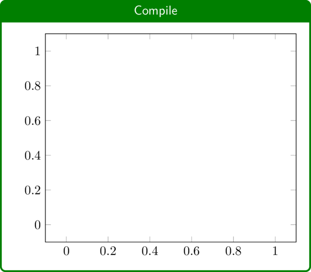

# PGFPlotsEdt Help

## Introduction

[PGFPlots](https://github.com/pgf-tikz/pgfplots) is a remarkable tool for creating high-quality statistical graphs in $\mathrm{\LaTeX}$, developed by Dr. Christian Feuersänger based on [PGF/TikZ](https://github.com/pgf-tikz/pgf). Since the popularity of Large Language Models (LLMs) like ChatGPT, it has been increasingly used by researchers as a code-based medium for creating plots. However, many people are still hesitant to apply PGFPlots to their daily work due to its extensive 500-page [documentation](https://mirrors.ctan.org/graphics/pgf/contrib/pgfplots/doc/pgfplots.pdf) or the frequent inquiries to ChatGPT.

PGFPlotsEdt: a PGFPlots statistic graph interactive editor, is a better entry tool for PGFPlots. It also offers faster compilation speed and provides stronger data privacy, helping users faster to PGFPlot in $\mathrm{\LaTeX}$.

**Better entry tool**: PGFPlotsEdt presents the main features of PGFPlots clearly through a graphical user interface. You can customize your statistical graph code using familiar modular graphical options.


**Faster compilation speed**: PGFPlotsEdt server, with the help of [mylatexformat](https://www.ctan.org/pkg/mylatexformat) caching technology [^1], allows you to test $\mathrm{\TeX}$ code faster. With moderate $\mathrm{\TeX}$ file lengths, it can achieve compilation speed in near real-time[^2].


[^1]: It is based on $\varepsilon-\mathrm{\TeX}$ engine. Acknowledge David Carlisle for the Chinese caching support method in the XeLaTeX program.

[^2]: Local deployment is required. Real-time performance requires the use of the pdfLaTeX compiler. See [pgfplots-benchmark](https://github.com/LogCreative/pgfplots-benchmark) repo for details.

**Stronger data privacy**: PGFPlotsEdt can be deployed locally, allowing it to run without internet connections, thus protecting privacy and avoiding the risk of data leakage to online tools. PGFPlotsEdt also includes a deployment solution for [Llama3](https://llama.meta.com/llama3/), which provides code insights using a local large language model[^3].


[^3]: Local deployment of the Llama3-8b model requires at least 6GB of available VRAM.

## Getting Started

You can quickly experience PGFPlotsEdt through the following website:

> [https://logcreative.github.io/PGFPlotsEdt](https://logcreative.github.io/PGFPlotsEdt)

The interface of PGFPlotsEdt consists of four main parts: the navigation bar at the top, the preview area on the left, the data area in the middle, and the code area on the right.


### Compilation Area
You can directly click the "Compile" button in the preview area to view the compilation result of the current chart. At this point, the result should only contain coordinate axes.



### Data Area
You can hover over the "+ Series" button in the data area and then click one of the data types: function, coordinate, or table. For example, after selecting the "function" type, you can see that a data series is generated, and you can enter an expression in the "function(x)" input box, such as `x/2`. When you are typing, you can see the mathematical formula $\frac{x}{2}$ is previewed automatically on the left.


### Code Area
After entering the data, you can see that the code in the code area is also updated, with a black block marking the last modified position. You can click the "Compile" button again to view the compilation result. If you are satisfied, you can click the first button in the code selection title bar to copy the PGFPlots code to the clipboard, and then you can insert it into your $\mathrm{\TeX}$ file[^4]; or you can download the PDF from the preview area and insert it into your $\mathrm{\TeX}$ file as an image[^5].


[^4]: You need to load the necessary packages in the preamble of your own file.

[^5]: It is recommended to click the "Copy all code" button (the second button in the Code area) to save the plot code next to the PDF file for later use.

Congratulations! You have generated your first statistical graph using PGFPlotsEdt!

### Navigation Area
There is one more area! Hover over the navigation area to see some presets of statistical graphs. Hover over the corresponding button to see the graph preview, and click the button to add it to the data. You can modify the related data in the template to plug-and-play. To learn more about how to implement and customize their styles, see the advanced documentation for details.

## Intermediate

### Code Structure

PGFPlotsEdt provides options to adjust the code structure that conforms to the original PGFPlots code. To better understand the logic of the interface, let's briefly explore the basic framework of PGFPlots code.

```latex
\documentclass[tikz]{standalone}
\usepackage{pgfplots}
\pgfplotsset{compat=newest}
\begin{document}
\begin{tikzpicture}
\begin{axis}[]
    \addplot [] {x/2};
\end{axis}
\end{tikzpicture}
\end{document}
```

The section before `\begin{document}` on line 4 is called the preamble, which is mainly used to load library code. This part is primarily set in the **Settings** section. The line `\begin{axis}[]` on line 6 represents the plot environment of PGFPlots. The optional parameters here set the style of the entire statistical graph and are mainly set in the **Axis** section. The line `\addplot [] {x/2};` on line 7 represents a function data series. The optional parameters here only affect the style of this data series and are mainly set in the parameter field of each data series in the **Data** section.

### Axis

Click on the "Axis" tab to expand the menu, where you can see the global settings for this statistical graph.

#### Surplus parameters
You can see a text box labeled "surplus parameters" on the first line. "Surplus" refers to the fact that these options will modify global parameters. Clicking on the "surplus parameters" text box will reveal a blue option list below: the first column represents the option name, the second column represents the translated (or explanation) name, and the third column may contain preview symbols.

As you start typing an option, the list will update to show options that match the typed prefix, and the closest match will be highlighted in the blue area. If you are satisfied with the options in the top blue area, you can press the <kbd>Enter</kbd> key to autocomplete. You will see that a comma (`,`) separator is automatically added.

For certain options, such as `mark`, you will see a `=...` hint on the right side of the top blue area. After pressing the <kbd>Enter</kbd> key, an equal sign (`=`) will be autocompleted, and secondary alternative options will be displayed. You need to further input the secondary option. You can still use the <kbd>Enter</kbd> key to autocomplete, or you could input the comma (`,`) to finish this option manually.

#### Global Parameters
The options in the "Global Parameters" section can be used to change the general characteristics of the statistical graph. Leave an option blank to use the default value.
##### Axis Type
You can choose between **axis**, **semilogxaxis**, **semilogyaxis**, **loglogaxis**, and **polaraxis** (requires enabling the **polar** in the **Settings** section).
##### Title
You can add your own title within the chart area, which will also update the title of your browser tab.
##### Width
Set the width of the chart area, e.g., `10cm`.
##### Height
Set the height of the chart area, e.g., `5cm`.
##### Fontsize
Set the font size of the chart area. Options include:
- $\text{\tiny tiny}$
- $\text{\scriptsize scriptsize}$
- $\text{\footnotesize footnotesize}$
- $\text{\small small}$
- $\text{\normalsize normalsize}$
- $\text{\large large}$
- $\text{\Large Large}$
- $\text{\LARGE LARGE}$
- $\text{\huge huge}$
- $\text{\Huge Huge}$
##### Grid
Add a grid to the chart area. **major** adds major grid lines, **minor** adds smaller tick marks on the axes, **both** adds both major and minor grid lines, and **none** does not add a grid.
##### Rotation Angle
*Visible only when 3D is enabled* The rotation angles of the coordinate axes in 3D: vertical angle (VA) and horizontal angle (HA). When the rotation angle value changes, the preview area will show the current state of the coordinate axes. You can also quickly change the rotation value by clicking and dragging left or right while holding down the left mouse button in the input text box, when the mouse pointer changes to $\leftrightarrow$.

##### Legend Position
*Visible only when the Legend is enabled* Choose the position of the legend in the chart area: **south west** (bottom left), **south east** (bottom right), **north west** (top left), **north east** (top right), **outer north east** (outside the chart area, top right).

#### X Axis (Y Axis, Z Axis)
For each coordinate axis, you can set certain properties separately.
##### Label
The label for the coordinate axis, displayed next to the axis.
##### Min
The minimum value of the coordinate axis.
##### Max
The maximum value of the coordinate axis.
##### Arrow
The arrow style of the coordinate axis: **box** (default box shape), **top** (arrowhead on top for x-axis, left for y-axis and z-axis), **middle** (middle arrowhead), **bottom** (arrowhead at the bottom for x-axis, **right** for y-axis and z-axis), **none** (no axis displayed).

### Settings

Click on the "Settings" tab to expand the menu, where you will see a series of checkboxes. Clicking on the checkbox next to each option allows you to enable or disable that option.

#### CTeX/CJK

Enable this option when there are Chinese characters in the graph. When the compiler is set to XeLaTeX, enabling this option will use the [`ctex` package](https://mirrors.ctan.org/language/chinese/ctex/ctex.pdf) (recommended); when the compiler is set to pdfLaTeX, enabling this option will use the [CJK package](https://www.ctan.org/pkg/cjk) (specifically, the `CJKutf8` package).

#### Beamer

Enable this option to generate charts suitable for insertion in the `beamer` document class for slides. When enabled, the most noticeable change is that the font changes from serif to sans-serif, consistent with `beamer`. In this mode, other features of the `beamer` document class are also available (such as overlays). For more details, refer to the documentation of the [`standalone` document class](https://mirrors.ctan.org/macros/latex/contrib/standalone/standalone.pdf) and the [`beamer` document class](https://mirrors.ctan.org/macros/latex/contrib/beamer/doc/beameruserguide.pdf).

#### Pin

Enable this option to add annotations when adding series. Further details on how to set annotations will be explained in the "Data" section.

#### 3D

Enable this option to add a z-axis to the coordinate system, allowing further customization of the z-axis in the "Axis" and "Data" sections.

#### Legend

Enable this option to allow each data series to have a legend name. The legends will be placed on the chart based on the "Legend Position" setting.

#### Source

Enable this option to add the "source" option when adding series. Table sources are used to reference data files that need to be reused.

#### plotmarks

Enable this option to use the [`plotmarks` TikZ library](https://mirrors.ctan.org/graphics/pgf/base/doc/pgfmanual.pdf#section.66). When setting the marker type using `mark=`, more options will be available.

#### colorbrewer

Enable this option to use the [`colorbrewer` PGFPlots library](https://mirrors.ctan.org/graphics/pgf/contrib/pgfplots/doc/pgfplots.pdf#section.5.2). When using options such as `color=`, `draw=`, `fill=`, more color options will be available.

#### colormaps

Enable this option to use the [`colormaps` PGFPlots library](https://mirrors.ctan.org/graphics/pgf/contrib/pgfplots/doc/pgfplots.pdf#section.5.3). When using the `colormap/` option in supplementary parameters, more gradient options will be available.

#### CMYK

Enable this option to convert the chart colors from RGB format to CMYK format, which is more suitable for color printing.

#### statistics

Enable this option to use the [`statistics` PGFPlots library](https://mirrors.ctan.org/graphics/pgf/contrib/pgfplots/doc/pgfplots.pdf#section.5.12). This library provides options for creating box plots (`boxplot`) and histograms (`hist`) in the parameters.

#### fillbetween

Enable this option to use the [`fillbetween` PGFPlots library](https://mirrors.ctan.org/graphics/pgf/contrib/pgfplots/doc/pgfplots.pdf#section.5.7). You can fill the gap between two series using this library. Refer to the PGFPlots package documentation for more details.

#### polar

Enable this option to use the [`polar` PGFPlots library](https://mirrors.ctan.org/graphics/pgf/contrib/pgfplots/doc/pgfplots.pdf#section.5.10). You can choose the "polaraxis" when selecting the "Type".

#### dateplot

Enable this option to use the [`dateplot` PGFPlots library](https://mirrors.ctan.org/graphics/pgf/contrib/pgfplots/doc/pgfplots.pdf#section.4.21.2). This allows dates to be used as input. Refer to the PGFPlots package documentation for more details.

### Data

In the "Data" section, the button of **+ Series** is the most prominent. With the maximum number of options enabled, you can add data series of types: **source**, **function**, **coordinate**, **file**, and **pin**.

#### source

*Visible only when Source is enabled* Can be used as a data source reference for the **file** type data series.

```
    <source name> (01) √ ↑ X T <file>
```

##### sr (Source name)
Used for subsequent name indexing and should not contain numbers (strictly speaking, it should comply with $\mathrm{\LaTeX}$ macro naming requirements). If the source name is invalid, it will be highlighted in red.
##### Source number
Since sources are not displayed on the chart and are not included in the layer numbering, the number is enclosed in parentheses.
##### Show Layer √
Whether to enable this source.
##### Move to top ↑
Move this source to the end of the code.
##### Delete source X
Delete this source.
##### Transpose source T
Transpose the data table of the file.
##### File
Select a data file. PGFPlots supports two types of data files: `dat` files with space-separated columns and `csv` files with comma-separated columns. The file content will be converted to plaintext and written into the source code.

#### function

Used to plot function graphs.

```
    <function name> [01] √ ↑ X + \ <parameters> <function(x)>
    <function name> [01] √ ↑ X z + \ <parameters> <x axis> <y axis> <z axis>
```

##### fn (Function name)
*Visible only when the Legend is enabled* Set the legend name for this function.
##### Layer Number
The layer number is enclosed in square brackets. A larger layer number means a higher position among layers, and a later position in the source code.
##### Show Layer √
Whether to enable this function series.
##### Move to Top ↑
Move this function to the end of the code.
##### Delete Series X
Delete this function.
##### 3D z
*Visible only when 3D is enabled* Whether to enable the z-axis for this function. If enabled, the function expression should be parameterized equations about $x$ on the three coordinate axes.
##### In cycle list +
Whether to use the cycle list, i.e., using `\addplot(3)+` instead of `\addplot(3)`. It is generally recommended to enable this option.
##### Closed plot ⇲
Whether to draw the area enclosed by the function and $y=0$, i.e., add `\closedcycle` and you could further use the `fill=` parameter option to fill the area.
##### Parameters
Options, separated by commas.
##### Function(x)
The function to be plotted, which should be a function of $x$.

#### coordinate

Used to plot coordinate series.

```
    <coordinate name> [01] √ ↑ X z + \ <parameters> <coord>
```

##### cd (Coordinate name)
*Visible only when the Legend is enabled* Set the legend name for this coordinate series.
##### Layer Number
The layer number is enclosed in square brackets. A larger layer number means a higher position among layers, and a later position in the source code.
##### Show Layer √
Whether to enable this coordinate series.
##### Move to Top ↑
Move this coordinate series to the end of the code.
##### Delete Series X
Delete this coordinate series.
##### 3D z
*Visible only when 3D is enabled* Whether to enable the z-axis for this coordinate series. If enabled, the coordinates should be three-dimensional.
##### In cycle list +
Whether to use the cycle list, i.e., using `\addplot(3)+` instead of `\addplot(3)`. It is generally recommended to enable this option.
##### Closed plot ⇲
Whether to draw the area enclosed by the coordinates and $y=0$, i.e., add `\closedcycle` and you could use the `fill=` parameter option to fill the area.
##### Parameters
Options, separated by commas.
##### Coord
Click on the "coord" text box to expand the coordinate data toolbar, which will automatically collapse when the mouse moves away from it.
###### Data quick input
Enter the coordinate data `<x> <y>` (or `<x> <y> <z>`) separated by spaces, and then press <kbd>Enter</kbd> to quickly add the data.
###### Sort/Group
In the case of two dimensions, it is "Sort", which is to sort the data in ascending order based on the independent variable (i.e., the first coordinate value). In the case of three dimensions, it is "Group", which is to group the three-dimensional coordinates into a format suitable for mesh or surf plots.
###### Format
Pair the numbers to make them in the format of coordinates. For example, `1 2 3 4` will be changed to `(1,2) (3,4)` (for three-dimensional coordinates, each coordinate contains three data).
###### Coordinate textbox
Manually modify the raw coordinate values.

#### table

Used to plot data from table files.

```
    <file name> [01] √ ↑ X z + \ <parameters> <table parameters> <data source> <file>
```

##### tb (File name)
*Visible only when Legend is enabled* Set the legend name for this table type data series.
##### Layer number
The layer number is enclosed in square brackets. A larger layer number means a higher position among layers, and a later position in the source code.
##### Show layer √
Whether to enable this table type data series.
##### Move to top ↑
Move this table type data series to the top layer.
##### Delete series X
Delete this table type data series.
##### 3D z
*Visible only when 3D is enabled* Whether to enable the z-axis for this table type data series. If enabled, the coordinates should be three-dimensional.
##### In cycle list +
Whether to use the cycle list, i.e., using `\addplot(3)+` instead of `\addplot(3)`. It is generally recommended to enable this option.
##### Closed plot ⇲
Whether to draw the area enclosed by the table type data series and $y=0$, i.e., add `\closedcycle` and you could use the `fill=` parameter option to fill the area.
##### Parameters
Options, separated by commas.
##### Table parameters
Set additional table parameters in the text box. Clicking on the text box will also pop up the "Table Parameter" toolbar, which is used to quickly set the table columns corresponding to the x-axis, y-axis (and z-axis). If the table column contains non-numeric elements, the coordinate axis will be automatically set as symbolic coordinates. The toolbar will collapse when the mouse moves away from it.
##### Source
*Visible only when Source is enabled* Select the source to be referenced. The default is `...`, which means no source is referenced, and you can upload a file for this series. If you select one of the sources, any additional uploaded file will be ignored.
##### File
Select a data file. PGFPlots supports two types of data files: `dat` files with space-separated columns and `csv` files with comma-separated columns. The file content will be converted to plaintext and written into the source code.

#### pin

*Visible only when Pin is enabled* Add text annotations to specific positions on the chart.

```
    <pin text> [01] √ ↑ X y <rotation angle> <pin coordinates>
```

##### pn (Pin text)
Set the text to be displayed for this annotation.
##### Layer number
The layer number is enclosed in square brackets. A larger layer number means a higher position among layers, and a later position in the source code.
##### Show layer √
Whether to enable this annotation.
##### Move to top ↑
Move this annotation to the top layer.
##### Delete pin X
Delete this annotation.
##### Yellow pin y
Whether to use the predefined yellow background annotation style `pin` and `small dot`. If enabled, the rotation angle needs to be set. In this style, the yellow background annotation text will be positioned at a certain distance and a certain angle from the annotation point. This style marks the precise position with a small black dot and connects the dot and the annotation text with a thin black line.
##### Rotation angle
*Visible only when Yellow pin is enabled* Set the rotation position of the text relative to the annotation point, in degree (°).
##### Pin coordinates
The coordinates of the annotation, with each coordinate axis separated by a comma (,), i.e., `x,y` (or `x,y,z`).

### Code

In the "Code" section, you can see the auto-generated code, and if necessary, you can switch to manual mode to directly modify the code.

#### Automatic mode

By default, it is in automatic mode, and you cannot directly modify the code. Three interactive buttons are provided.

##### Copy plot code to clipboard ▪
Click this button to copy the plot code (the part inside the `tikzpicture` environment) to the clipboard. The copied part will be highlighted with a green box.
##### Copy all code to clipboard ◼
Click this button to copy all the code to the clipboard. The copied part will be highlighted with a green box.
##### Edit code manually ⚠
Click this button to switch to manual mode. Please note that once you switch to manual mode, you cannot return to automatic mode.

#### Manual mode

In this mode, you can modify the code manually.

##### Code editor
The code editor provides LaTeX code completion, especially for the PGFPlots package. Press Ctrl+S (or Command+S) to trigger compilation.
##### Large Language Model (LLM) code completion
*Only available when the local large language model is enabled* Use the locally deployed [Llama3](https://llama.meta.com/llama3/) model for intelligent code completion.
###### LLM completion prompt
Input the natural language prompt to update the code, such as `Plot the graph of x^2`.
###### Generate ✨
Click the "✨ Generate" button to invoke the LLM to generate code. The real-time output of the LLM will be updated in the editor. Do not modify the code during this time, as it will result in the loss of any modifications. A loading icon will be displayed during the loading process. You can use the compile button to test the generated code and decide whether to accept the results from the LLM.
###### Accept √
Press the "√ Accept" button to accept the generated code from the LLM, clear the selection, and empty the command text box.
###### Reject X
Press the "X Reject" button to reject the generated code from the LLM and revert back to the previous code. Note that this operation will cause all modifications made after generating the code to be lost.

### Navigation

The navigation bar contains miscellaneous options. Hover over the navigation bar area to expand more options.

#### Logo
The logo of PGFPlotsEdt. Clicking on the logo will expand the "About" screen, and clicking again will close the "About" screen.
#### Do not use the faster compiler service
Check the checkbox to force PGFPlotsEdt to use the online compilation service provided by [LaTeX Online](https://latexonline.cc/).
#### Templates
PGFPlots provides various presets for different statistical graph types. Clicking the template button will add it both to the data in automatic mode and to the code in manual mode.
#### Language
Select the interface language. This operation is a hot reload and does not cause data loss.
#### Compiler
Select the compiler to use: pdfLaTeX or XeLaTeX. It is recommended to use XeLaTeX compiler when the plot contains Chinese characters, otherwise, pdfLaTeX is recommended for faster compilation speed.
#### External Links
Some related links. Click on the corresponding button to view details.
##### Quick start
$\mathrm{\LaTeX}$ Sparkle Project ["Chapter 6: Simple Statistical Charts"](https://logcreative.github.io/LaTeXSparkle/src/art/chapter06.html) page. This page provides a beginner's tutorial for the PGFPlots package, as well as an index of markers, colorbrewer, and colormaps.
##### Package documentation
The official [documentation](https://mirrors.ctan.org/graphics/pgf/contrib/pgfplots/doc/pgfplots.pdf) of the PGFPlots package.
##### GitHub
The [GitHub repository](https://github.com/LogCreative/PGFPlotsEdt) of PGFPlotsEdt.
##### Vue.js
Vue.js [homepage](https://vuejs.org/). PGFPlotsEdt is based on Vue 2.6.11.
##### LaTeX Online
LaTeX Online [homepage](https://latexonline.cc/). PGFPlotsEdt may use the online compilation service of LaTeX Online.
##### MathJax
MathJax [homepage](https://www.mathjax.org/). The function preview feature of PGFPlotsEdt is based on MathJax.
##### Llama3
*Only available when the local large language model is enabled* Llama 3 [homepage](https://llama.meta.com/llama3/). PGFPlotsEdt uses the Llama3 large language model for code generation assistance.

## Advanced

PGFPlotsEdt provides multiple advanced deployment modes. The table below compares the features of different deployment modes.

| Mode | URL | Comp. Scheme | Comp. Speed | LLM |
| ---- | --- | ----------------- | ----------------- | ----------- |
| Online | [online link](https://logcreative.github.io/PGFPlotsEdt) | LaTeX Online | Normal | |
| Open locally | `index.html` | LaTeX Online | Normal | |
| Local Compilation | [http://127.0.0.1:5678](http://127.0.0.1:5678) | Header format cache | Fast | |
| Deployment Compilation | [http://0.0.0.0:5678](http://127.0.0.1:5678) | Header format hash cache | Faster | |
| LLM | [http://127.0.0.1:5678](http://127.0.0.1:5678) | Header format cache | Fast | Yes |

: Comparison of deployment modes, Comp.=Compilation

Before proceeding with the following steps, you should first download or clone the code from the [GitHub repository](https://github.com/LogCreative/PGFPlotsEdt).

### Open locally

Open `index.html` in your browser to start PGFPlotsEdt locally.

### Local compilation

> **System requirements**: [TeX distribution](https://www.ctan.org/starter) (TeX Live, MacTeX, MiKTeX, etc.), [Python](https://www.python.org/downloads/) (including the [`flask` package](https://flask.palletsprojects.com/en/latest/))

Enter the following command in the terminal to start the local PGFPlots server:
```bash
    python ppedt_server.py
```
Open [http://127.0.0.1:5678](http://127.0.0.1:5678) in your browser to use the fast local compilation service. Press <kbd>Ctrl</kbd>+<kbd>C</kbd> in the terminal to stop the server.

### Deployment compilation

Use either the **Container deployment** or **Manual deployment** method to deploy the compilation service, which is faster and provides stronger security for multiple users. The deployment will be accessible at `http://[LAN IP]:5678` (you can still access it locally at [http://127.0.0.1:5678](http://127.0.0.1:5678)).

#### Container deployment

> **System requirements**: [Docker](https://www.docker.com/products/docker-desktop/)

You can deploy PGFPlotsEdt by using either the **Pre-built image** or **Manual image build** method.

##### Pre-built image

Run one of the following commands in the terminal to start the pre-compiled image in Docker:
```bash
    docker run logcreative/pgfplotsedt:master          # Docker Hub
    docker run ghcr.io/logcreative/pgfplotsedt:master  # GitHub Packages
```

##### Manual image build

Use the following command in the terminal to manually build the image from scratch:
```bash
    cd deploy && docker-compose up --build
```

#### Manual deployment

> **System requirements**: macOS or Linux operating system, [TeX distribution](https://www.ctan.org/starter) (TeX Live, MacTeX, MiKTeX, etc.), [Python](https://www.python.org/downloads/) (including the [`flask` package](https://flask.palletsprojects.com/en/latest/), [`gunicorn` package](https://gunicorn.org/))

Enter the following command in the terminal to start the deployment server:
```bash
    cd deploy && python gunicorn-deploy.py
```
Press <kbd>Ctrl</kbd>+<kbd>C</kbd> in the terminal to stop the server. Configs could be modified in `deploy/config.py` before starting the server.

### PGFPlots with LLM

> **System Requirements**: GPU with 6GB available VRAM, [TeX distribution](https://www.ctan.org/starter) (TeX Live, MacTeX, MiKTeX, etc.), [Anaconda](https://www.anaconda.com/download/success)

Enter the following command in the terminal to install the dependencies:
```bash
    conda env update -n ppedt -f ppedt_server_llm.yml
```
Then activate the created conda environment and start the PGFPlots with LLM:
```bash
    conda activate ppedt
    python ppedt_server_llm.py
```
The first time you start, it will download the LLM weights (which will be saved in `~/.cache/mlc_llm`) and optimize the deployment using the [MLC LLM](https://llm.mlc.ai) library. Open [http://127.0.0.1:5678](http://127.0.0.1:5678) in your browser to use the fast compilation service and activate the large language model feature. Press <kbd>Ctrl</kbd>+<kbd>C</kbd> *twice* in the terminal to stop the large model server.

## URL Shortcuts

The url supports passing options in a RESTful manner. Opening a URL with options will preserve the options when reloading. In the table, `PGFPlots://` represents the url corresponding to your deployment mode, for example:
```
    https://logcreative.github.io/PGFPlotsEdt
```
Use `&` to separate multiple options, for example:
```
    https://logcreative.github.io/PGFPlotsEdt?lang=chs&code_only
```

| Function | URL | Remarks |
| ---- | ---- | ---- |
| English | [PGFPlots://](https://logcreative.github.io/PGFPlots) | |
| Simplified Chinese | [PGFPlots://?lang=chs](https://logcreative.github.io/PGFPlotsEdt?lang=chs) | XeLaTeX compiler and CTeX enabled |
| About screen | [PGFPlots://?show_about](https://logcreative.github.io/PGFPlotsEdt?show_about) | Expand the about screen |
| Manual editing | [PGFPlots://?code_only](https://logcreative.github.io/PGFPlotsEdt?code_only) | Enter manual code editing mode |
| pdfLaTeX | [PGFPlots://?compiler=pdflatex](https://logcreative.github.io/PGFPlotsEdt?compiler=pdflatex) | pdfLaTeX compiler |
| XeLaTeX | [PGFPlots://?compiler=xelatex](https://logcreative.github.io/PGFPlotsEdt?compiler=xelatex) | XeLaTeX compiler |
| Disable fast compilation | [PGFPlots://?nofast](https://logcreative.github.io/PGFPlotsEdt?nofast) | Fast compilation service disabled |

: URL Shortcuts


## Copyright Information

##### PGFPlotsEdt

Copyright © 2020-2024 Log Creative

This program is free software; you can redistribute it and/or modify it under the terms of the GNU Affero General Public License as published by the Free Software Foundation; either version 3 of the License, or (at your option) any later version.

This program is distributed in the hope that it will be useful, but WITHOUT ANY WARRANTY; without even the implied warranty of MERCHANTABILITY or FITNESS FOR A PARTICULAR PURPOSE. See the [GNU Affero General Public License](https://github.com/LogCreative/PGFPlotsEdt/blob/master/LICENSE) for more details.

##### PGFPlots

Copyright © 2007-2020 Christian Feuersaenger, licensed under the [GNU-3.0 License](http://www.gnu.org/licenses/).

##### Llama 3

Copyright © Meta Platforms, Inc. All Rights Reserved. Meta Llama 3 is licensed under the [Meta Llama 3 Community License](https://llama.meta.com/llama3/license/).

##### MathJax

MathJax is licensed under the [Apache-2.0 License](https://github.com/mathjax/MathJax-src/blob/master/LICENSE).

##### LaTeX Online

Copyright © 2016 Andrey Lushnikov, licensed under the [MIT License](https://github.com/aslushnikov/latex-online/blob/master/LICENSE.txt).

##### Vue.js

Copyright © 2013-present, Yuxi (Evan) You, licensed under the [MIT License](https://github.com/vuejs/vue/blob/main/LICENSE).

> Copyright information for other third-party libraries used by PGFPlotsEdt is listed in a [separate file](https://github.com/LogCreative/PGFPlotsEdt/blob/master/lib/README.md).
