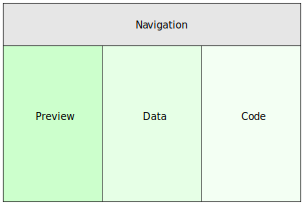
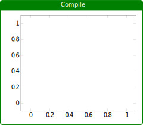
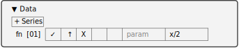
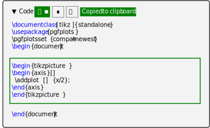

# PGFPlotsEdt 帮助——简体中文版

## 引言

[PGFPlots](https://github.com/pgf-tikz/pgfplots) 由 Dr. Christian Feuersänger 基于 [PGF/TikZ](https://github.com/pgf-tikz/pgf) 开发，是 $\mathrm{\LaTeX}$ 中绘制高质量统计图的重要工具。在 ChatGPT 爆火之后，作为绘图的代码式媒介，它已经被越来越多的研究人员使用。但是面对 500 多页的[文档](https://mirrors.sjtug.sjtu.edu.cn/CTAN/graphics/pgf/contrib/pgfplots/doc/pgfplots.pdf)或频繁的 ChatGPT 询问，很多人对于将 PGFPlots 应用于日常学习工作中仍然望而却步。

PGFPlotsEdt：统计绘图交互式编辑器，是 PGFPlots 更好的入门工具、具有更快的编译速度、提供更强的数据隐私，可以帮助用户更快地使用 $\mathrm{\LaTeX}$ 编辑 PGFPlots 图形。

**更好的入门工具** PGFPlotsEdt 通过图形式菜单将 PGFPlots 的主要功能清晰呈现，您可以通过熟悉的模块化图形选单调配出个性化的统计图代码。

**更快的编译速度** PGFPlotsEdt 服务程序借助于 $\varepsilon\mathrm{-\TeX}$ 的缓存技术可以帮助您更快地测试 $\mathrm{\TeX}$ 代码，在适中 $\mathrm{\TeX}$ 文件长度下可以达到接近实时的编译速度[^1]。

[^1]: 需要本地部署或使用[官方网站](https://logcreative.tech/PGFPlotsEdt)，即时性的效果需要使用 pdfLaTeX 编译器。

**更强的数据隐私** PGFPlotsEdt 可以自行被部署于本地环境，在不联网的情况下仍然可以运行从而保护隐私，免受向在线工具泄漏数据的风险。PGFPlotsEdt 还内置了 [Llama3](https://llama.meta.com/llama3/) 的部署方案[^2]，可以直接使用本地大语言模型获得代码见解。

[^2]: 本地部署 Llama3-8b 模型至少需要 6GB 可用显存。

## 入门

PGFPlotsEdt 可以通过下面的网站快速体验：

> [https://logcreative.tech/PGFPlotsEdt?lang=chs](https://logcreative.tech/PGFPlotsEdt?lang=chs)

PGFPlotsEdt 的界面大致由 4 个部分组成，顶部为导航栏，左侧为预览区，中间为数据区，右侧为代码区。



### 编译区
您可以直接点击预览区的“编译”按钮查看当前图表的编译结果，当然此时的结果应该只有一个空白的坐标轴区域。



### 数据区
您可以用鼠标悬停至“+ 系列”按钮，然后点击其中一种类型的数据：函数、坐标、文件。比如选择“函数”类型后，可以看到一个数据系列就被产生了，可以在“函数式”一栏输入表达式，比如 `x/2`，这时可以看到预览区出现了数学公式的预览结果 $\frac{x}{2}$。



### 代码区
完成数据的输入后，可以看到代码区的代码也得到了更新，黑色方块标记着上次修改的位置。您可以再次点击“编译”按钮查看编译结果，如果认为满意，可以点击代码选区标题栏第一个按钮，将绘图代码复制到剪贴板，之后就可以插入您的 $\mathrm{\TeX}$ 文件中使用了[^3]；或者下载预览区的 PDF 通过插入图片的方式插入到您的 $\mathrm{\TeX}$ 文件中[^4]。



[^3]: 需要在自己文件的导言区加载必要的宏包。

[^4]: 推荐按下复制全部代码按钮（代码区第二个按钮），将绘图代码保存至 PDF 文件旁备用。

至此，您已经通过 PGFPlotsEdt 生成了第一个统计图！

### 导航区
还有一个区域！悬停在导航区上，可以看到一些预设的统计图类型，悬停在对应的按钮上就可以看到对应的样式预览，点击按钮就可以将其添加到数据中，将相关数据进行修改就可以实现模板的即插即用。至于如何实现和细致修改它们的样式，将在进阶文档中展开。

## 进阶

### 代码结构

PGFPlotsEdt 提供了符合原始 PGFPlots 代码结构的调整选项。为了更好地理解界面的操作逻辑，现在简要了解一下 PGFPlots 代码的基本框架。

```latex
\documentclass[tikz]{standalone}
\usepackage{pgfplots}
\pgfplotsset{compat=newest}
\begin{document}
\begin{tikzpicture}
\begin{axis}[]
    \addplot [] {x/2};
\end{axis}
\end{tikzpicture}
\end{document}
```

在第 4 行 `\begin{document}` 之前被称为导言区，主要用于加载库代码，这一部分主要由**设定**选区设置；第 6 行 `\begin{axis}[]` 是 PGFPlots 的图表环境，此处的可选参数会设定整个统计图的样式，主要由**坐标系**选区设置；第 7 行 `\addplot [] {x/2};` 是函数数据系列，此处的可选参数只会这个数据系列的样式，主要由**数据**选区的每个数据系列的参数栏设定。

### 坐标系

点击“坐标系”标签栏，展开菜单，您可以看到关于这个统计图的全局设定。

#### 增补参数
您可以看到第一行有一个“增补参数”的文本框，“增补”一词是相较于下面的选项而言的，它们都会更改全局参数。点击“增补参数”文本框，可以看到下方展开了一个蓝色的选项列表：第一列为选项名称，第二列为翻译名称，第三列可能含有预览记号。

当您开始键入选项时，该列表会更新为与键入文字前缀一致的选项，并将最接近的选项放入蓝色区域高亮，如果对于顶部蓝色区域的备选项已经满意，按下键盘的 <kbd>Enter</kbd> 键即可进行补全，您可以看到选项分隔符逗号（`,`）也已被自动添加。

对于某些选项，比如 `mark`，您可以在顶部蓝色区域右侧看到一个 `=...` 标记，此时按下 <kbd>Enter</kbd> 键后会补全等号（`=`），并显示二级备选选项，您需要进一步输入二级选项，此时您仍然可以使用 <kbd>Enter</kbd> 键进行补全，或者手动输入逗号（`,`）结束该选项的输入。

#### 全局参数
“全局参数”一栏的选项可以用来更改统计图的普遍特征，选项留空则会使用默认值。
##### 轴类型
可以选择**普通坐标轴**、**x对数轴**、**y对数轴**、**双对数轴**、**极坐标轴**（需要在**设定**中开启**极坐标库**可见）。
##### 标题
可以在图表区内置您的标题，这一项也会同步修改您浏览器标签页的标题。
##### 宽度
设置图表区宽度，比如 `10cm`。
##### 高度
设置图表区高度，比如 `5cm`。
##### 字号
设置图表区字号大小，可以选择：
- $\text{\tiny tiny}$
- $\text{\scriptsize scriptsize}$
- $\text{\footnotesize footnotesize}$
- $\text{\small small}$
- $\text{\normalsize normalsize}$
- $\text{\large large}$
- $\text{\Large Large}$
- $\text{\LARGE LARGE}$
- $\text{\huge huge}$
- $\text{\Huge Huge}$
##### 网格
用于添加图表区域网格，**major** 会添加主要网格线，**minor** 会在坐标轴上添加更小的刻度值，**both** 会添加上述两者，**none** 则不会添加网格。
##### 旋转角度
*仅启用三维时可见* 坐标轴的三维旋转角度：竖直旋转和水平选旋转。当旋转角度值改变时，预览区将会展示当前坐标轴状态的预览。您还可以通过在输入文本框内按住鼠标左键，使得鼠标指针变为 $\leftrightarrow$ 时向左右移动来快速改变旋转值。
##### 图例位置
*仅启用图例时可见* 选择图例在图表区的位置：**south west**（左下），**south east**（右下），**north west**（左上），**north east**（右上），**outer north east**（图表区外右上）。
#### x轴（y轴、z轴）
对于每一个坐标轴都可以分别设定一些属性。
##### 轴题
坐标轴的标签，显示在坐标轴旁边。
##### 最小
坐标轴的最小值。
##### 最大
坐标轴的最大值。
##### 箭头
坐标轴的箭头样式：**box**（默认盒状），**top**（x轴箭头状在顶部，y轴、z轴为left在左侧），**middle**（中部箭头状），**bottom**（x轴箭头状在底部，y轴、z轴为**right**在右侧），**none**（不显示坐标轴）。

### 设定

点击“设定”标签栏，展开菜单，将会看到一系列的多选框选项，单击每一个选项前的方块可以设定是否启用该项。

#### CTeX/CJK

是否使用中文支持宏包 $\mathrm{C\TeX}$ 或 CJK，当统计图中有中文字符时需要启用该项。当编译器被设定为 XeLaTeX 时，启用该项将会使用 [`ctex` 宏包](https://mirrors.sjtug.sjtu.edu.cn/CTAN/language/chinese/ctex/ctex.pdf)（推荐）；当编译器被设定为 pdfLaTeX 时，启用该项将会使用 [CJK 宏包](https://www.ctan.org/pkg/cjk)（更确切地说，是 `CJKutf8` 宏包）。

#### 幻灯优化

是否产生适合插入在幻灯片文档类 `beamer` 中的图表。启用该项后，最明显的部分是字体由衬线体变更为和 `beamer` 一致的非衬线体。当然，这一模式下还有使用 `beamer` 文档类的其他功能（比如覆盖功能），具体详见 [`standalone` 文档类](https://mirrors.sjtug.sjtu.edu.cn/CTAN/macros/latex/contrib/standalone/standalone.pdf) 和 [`beamer` 文档类](https://mirrors.sjtug.sjtu.edu.cn/CTAN/macros/latex/contrib/beamer/doc/beameruserguide.pdf) 的文档。

#### 启用标注

启用该项后，添加系列时将会增加“标注”选项。具体如何设置标注将会在“数据”一节中进一步展开。

#### 启用三维

启用该项后，坐标系中将会增加z轴，可以在“坐标系”和“数据”中进一步设定z轴的相关情况。

#### 启用图例

启用该项后，每一个数据系列将被允许设定图例名称，图例将会根据“图例位置”放置在图表上。

#### 启用数据源

启用该项后，添加系列时将会增加“表源”选项。表源会被用于索引需要重复使用的数据文件。

#### 启用标记库

启用该项后，代码中会使用 [`plotmarks` TikZ 库](https://mirrors.sjtug.sjtu.edu.cn/CTAN/graphics/pgf/base/doc/pgfmanual.pdf#section.66)，当您使用 `mark=` 设定标记类型时将会有更多的选择。

#### 颜色库

启用该项后，代码中会使用 [`colorbrewer` PGFPlots 库](https://mirrors.sjtug.sjtu.edu.cn/CTAN/graphics/pgf/contrib/pgfplots/doc/pgfplots.pdf#section.5.2)，当您使用 `color=`、`draw=`、`fill=` 等涉及颜色设置的选项时将会有更多的选择。

#### 渐变库

启用该项后，代码中会使用 [`colormaps` PGFPlots 库](https://mirrors.sjtug.sjtu.edu.cn/CTAN/graphics/pgf/contrib/pgfplots/doc/pgfplots.pdf#section.5.3)，当您在增补参数中使用 `colormap/` 选项时会有更多的选择。

#### CMYK

启用该项后，图表颜色将会从 RGB 格式转换为 CMYK 格式，更适合彩色印刷。

#### 统计库

启用该项后，代码中会使用 [`statistics` PGFPlots 库](https://mirrors.sjtug.sjtu.edu.cn/CTAN/graphics/pgf/contrib/pgfplots/doc/pgfplots.pdf#section.5.12)，参数中会增加箱式图 `boxplot` 和直方图 `hist` 选项。

#### 间隙填充库

启用该项后，代码中会使用 [`fillbetween` PGFPlots 库](https://mirrors.sjtug.sjtu.edu.cn/CTAN/graphics/pgf/contrib/pgfplots/doc/pgfplots.pdf#section.5.7)，您可以填充两个系列之间的间隙，详情参见 PGFPlots 宏包文档。

#### 极坐标库

启用该项后，代码中会使用 [`polar` PGFPlots 库](https://mirrors.sjtug.sjtu.edu.cn/CTAN/graphics/pgf/contrib/pgfplots/doc/pgfplots.pdf#section.5.10)，您在选择“坐标轴”时可以选择“极坐标轴”。

#### 日期库

启用该项后，代码中会使用 [`dateplot` PGFPlots 库](https://mirrors.sjtug.sjtu.edu.cn/CTAN/graphics/pgf/contrib/pgfplots/doc/pgfplots.pdf#section.4.21.2)，此时日期可以被作为输入，详情参见 PGFPlots 宏包文档。

### 数据

在“数据”一栏，最醒目的是添加**系列**的按钮。启用最多选项的情况下，可以添加**表源**、**函数**、**坐标**、**文件**、**标注**类型的数据系列。

#### 表源

*仅启用数据源时可见* 可以作为**文件**类型数据系列的数据源引用。

```
  <表源名称> (01) √ ↑ X T <文件>
```

##### 表源名称
用于后续的名称索引，不能包含数字（严格来说应当符合 $\mathrm{\LaTeX}$ 宏的命名要求），如果表源名称违规将被标红。
##### 表源编号
由于表源不会被显示在图表上，不会纳入图层编号，所以使用小括号包裹编号。
##### 显示图层√
是否启用该表源。
##### 置于顶层↑
移动该表源在代码中的位置于表源的最后。
##### 删除表源X
删除该表源。
##### 转置表源T
转置文件的数据表。
##### 文件
选择数据文件。PGFPlots 支持两种数据文件：以空格分隔表列的 `dat` 文件和以逗号分隔表列的 `csv` 文件。文件内容将会被转换为明文形式写入源代码中。

#### 函数

用于绘制函数图像。

```
  <函数名称> [01] √ ↑ X + \ <参数> <函数式(x)>
  <函数名称> [01] √ ↑ X z + \ <参数> <x轴> <y轴> <z轴>
```

##### 函数名称
*仅启用图例时可见* 设置该函数的图例名称。
##### 图层编号
图层编号用方括号包裹起来，图层编号越大表明图层位置越靠近顶层，在源代码中的位置越靠后。
##### 显示图层√
是否启用该函数系列。
##### 置于顶层↑
将该函数的图层位置置于顶层。
##### 删除系列X
删除该函数。
##### 三维坐标z
*仅启用三维时可见* 是否启用该函数的z轴。启用后函数式应当是关于 $x$ 的三个坐标轴上的参数方程。
##### 样式连续+
是否延续样式设置，即使用 `\addplot(3)+` 而不是 `\addplot(3)`，一般情况下推荐开启。
##### 封闭曲线⇲
是否对函数与 $y=0$ 围成的曲面图形进行绘制，即添加 `\closedcycle`，配合 `fill=` 参数选项对该曲面图形进行填充。
##### 参数
参数选项，用逗号分隔各个选项。
##### 函数式(x)
需要绘制的函数，它应当以 $x$ 作为自变量。

#### 坐标

用于绘制坐标系列的图像。

```
  <坐标名称> [01] √ ↑ X z + \ <参数> <坐标数据>
```

##### 坐标名称
*仅启用图例时可见* 设置该坐标系列的图例名称。
##### 图层编号
图层编号用方括号包裹起来，图层编号越大表明图层位置越靠近顶层，在源代码中的位置越靠后。
##### 显示图层√
是否启用该坐标系列。
##### 置于顶层↑
将该坐标系列的图层位置置于顶层。
##### 删除系列X
删除该坐标系列。
##### 三维坐标z
*仅启用三维时可见* 是否启用该坐标系列的z轴。启用后坐标应当是三维坐标。
##### 样式连续+
是否延续样式设置，即使用 `\addplot(3)+` 而不是 `\addplot(3)`，一般情况下推荐开启。
##### 封闭曲线⇲
是否对坐标系列与 $y=0$ 围成的曲面图形进行绘制，即添加 `\closedcycle`，配合 `fill=` 参数选项对该曲面图形进行填充。
##### 参数
参数选项，用逗号分隔各个选项。
##### 坐标数据
点击坐标数据文本框，展开坐标数据工具栏，当鼠标移开工具栏后会被自动折叠。
###### 数据快速输入文本框
输入坐标数据 `<x> <y>`（或者是 `<x> <y> <z>`），不同数据间使用空格隔开，然后按下 <kbd>Enter</kbd> 键即可快速添加数据。
###### 排序/分组
二维情况下，显示“排序”，按自变量（即第一个坐标值）升序对数据进行排序。三维情况下，显示“分组”，将会对三维坐标分组为符合曲面图的数据格式。
###### 格式正规化
按照顺序使用括号标记坐标，会按顺序对数据进行配对，例如 `1 2 3 4` 会被变更为 `(1,2) (3,4)`。（三维坐标时每个坐标包含三个数据）
###### 坐标值文本框
可以手动对坐标值进行修改。

#### 文件

用于绘制文件中的数据。

```
  <文件名称> [01] √ ↑ X z + \ <参数> <表参数> <数据源> <文件>
```

##### 文件名称
*仅启用图例时可见* 设置该文件类型数据系列的图例名称。
##### 图层编号
图层编号用方括号包裹起来，图层编号越大表明图层位置越靠近顶层，在源代码中的位置越靠后。
##### 显示图层√
是否启用该文件类型数据系列。
##### 置于顶层↑
将该文件类型数据系列的图层位置置于顶层。
##### 删除系列X
删除该文件类型数据系列。
##### 三维坐标z
*仅启用三维时可见* 是否启用该文件类型数据系列的z轴。启用后坐标应当是三维坐标。
##### 样式连续+
是否延续样式设置，即使用 `\addplot(3)+` 而不是 `\addplot(3)`，一般情况下推荐开启。
##### 封闭曲线⇲
是否对文件类型数据系列与 $y=0$ 围成的曲面图形进行绘制，即添加 `\closedcycle`，配合 `fill=` 参数选项对该曲面图形进行填充。
##### 参数
参数选项，用逗号分隔各个选项。
##### 表参数
文本框内设置额外的表格参数。点击该文本框后还会弹出“表格参数”的工具栏，用于快速设置表格中x轴、y轴（、z轴）对应的表列，如果该表列中含有非数字的元素，则会对该坐标轴自动设置符号化坐标，鼠标从该工具栏移开后折叠。
##### 数据源
*仅启用数据源时可见* 选择需要引用的数据源。默认为 `...`，表示不引用任何数据源，此时在该系列中上传文件；如果选定引用其中一个数据源，则会忽略额外上传的文件。
##### 文件
选择数据文件。PGFPlots 支持两种数据文件：以空格分隔表列的 `dat` 文件和以逗号分隔表列的 `csv` 文件。文件内容将会被转换为明文形式写入源代码中。

#### 标注

*仅启用标注时可见* 对图表的特定位置添加文字标注。

```
  <标注文字> [01] √ ↑ X y <旋转角度> <标注坐标>
```

##### 文件名称
设置该标注需要显示的文字。
##### 图层编号
图层编号用方括号包裹起来，图层编号越大表明图层位置越靠近顶层，在源代码中的位置越靠后。
##### 显示图层√
是否启用该标注。
##### 置于顶层↑
将该标注的图层位置置于顶层。
##### 删除系列X
删除该标注。
##### 黄色标注y
是否使用预置的黄色背景标注样式 `pin` 和 `small dot`，启用后需要设定旋转角度。该样式下黄色背景的标注文字会距离标注位置一定距离、并在旋转一定角度的地方，该样式会通过一个小黑点标记准确位置，并通过一条细黑线连接小黑点和标注文字。
##### 旋转角度
*仅黄色标注启用时可用* 设置文字相对于标注点的旋转位置，以度（°）为单位。
##### 标注坐标
标注位置，每个坐标轴坐标以半角逗号隔开(,)，即 `x,y`（或 `x,y,z`）。

### 代码

在“代码”一栏可以看到自动生成的代码，必要时还可以切换为手动模式直接修改代码。

#### 自动模式

默认情况下为自动模式，无法直接修改代码。提供三个交互按钮。

##### 复制绘图代码▪
点击该按钮复制绘图代码（`tikzpicture` 环境内的部分）至剪贴板，复制的部分以绿色方框标出。
##### 复制全部代码◼
点击该按钮复制全部代码至剪贴板，复制的部分以绿色方框标出。
##### 手动编辑代码⚠
点击该按钮会转变为手动模式，请注意转变为手动模式后将无法返回自动模式。

#### 手动模式

转变为该模式后可以手动修改代码。

##### 代码编辑器
代码编辑器会提供 $\mathrm{\LaTeX}$ 代码补全，特别是 PGFPlots 宏包的代码补全。按下 Ctrl+S（或 Command+S）快捷键可以触发编译。
##### 大模型代码补全
*仅本地大模型启用时可用* 使用本地部署的 [Llama3](https://llama.meta.com/llama3/) 模型对代码智能补全。
###### 大模型补全指令
输入自然语言指令以更新代码，自然语言指令如 `绘制x^2的函数图像`。
###### 生成✨
点击“✨生成”按钮调用大语言模型对代码进行生成，大语言模型的实时输出结果会更新在编辑器内，请勿在此时修改代码否则会造成修改丢失，加载过程中会显示加载图标。您可以使用编译按钮试验生成的代码，并决定是否接受大语言模型的结果。
###### 接受√
按下“接受”按钮以接受大语言模型的生成结果，清除选区并清空指令文本框。
###### 拒绝X
按下“拒绝”按钮以拒绝大语言模型的生成结果，还原回之前的代码。注意此操作会导致生成代码后的所有修改丢失。

### 导航栏

导航栏包含一些杂项选项，鼠标悬浮在导航栏区域内展开更多的选项。

#### 徽标
PGFPlotsEdt 的徽标。点击徽标会展开“关于”屏幕，再次点击徽标关闭关于屏幕。
#### 不使用快速编译服务
勾选复选框后，强制 PGFPlotsEdt 使用 [LaTeX Online](https://latexonline.cc/) 提供的在线编译服务。
#### 模板
PGFPlots 提供了多种统计图类型预设，点击模板按钮，在自动模式下可以添加到数据中，在手动模式下也会添加到代码中。
#### 语言
选择界面显示的语言。该操作是热刷新不会导致数据丢失。
#### 编译器
选择需要使用的编译器：pdfLaTeX 或 XeLaTeX。统计图中包含中文的情况下推荐使用 XeLaTeX 编译器，否则推荐使用 pdfLaTeX 以达到更快的编译速度。
#### 外链
一些相关链接，点击对应按钮查看详情。
##### 宏包入门
像模像样 $\mathrm{\LaTeX}$ [“第六节 简约统计图”](https://logcreative.github.io/LaTeXSparkle/src/art/chapter06.html) 页面。该页面提供 PGFPlots 宏包的入门教程，以及标记、颜色、渐变的索引。
##### 宏包文档
PGFPlots 宏包的[官方文档](https://mirrors.sjtug.sjtu.edu.cn/CTAN/graphics/pgf/contrib/pgfplots/doc/pgfplots.pdf)。
##### GitHub
PGFPlotsEdt 的 [GitHub 存储库页面](https://github.com/LogCreative/PGFPlotsEdt)。
##### Vue.js
Vue.js [主页](https://cn.vuejs.org/)。PGFPlotsEdt 基于 Vue 2.6.11。
##### LaTeX Online
LaTeX Online [主页](https://latexonline.cc/)。PGFPlotsEdt 可能会使用 LaTeX Online 的在线编译服务。
##### MathJax
MathJax [主页](https://www.mathjax.org/)。PGFPlotsEdt 的函数预览功能基于 MathJax。
##### Llama3
*仅本地大模型启用时可用*  Llama 3 [主页](https://llama.meta.com/llama3/)。PGFPlotsEdt 使用 Llama3 大语言模型用于辅助代码生成。

## 高级

PGFPlotsEdt 提供多种高级部署模式，表中为多种部署模式的特性比较。

|模式|地址|编译方案|编译速度|大模型|
|----|----|----|----|----|
|国内在线|[https://logcreative.tech/PGFPlotsEdt](https://logcreative.tech/PGFPlotsEdt)|头文件哈希缓存|更加快速||
|国际在线|[https://logcreative.github.io/PGFPlotsEdt](https://logcreative.github.io/PGFPlotsEdt)|LaTeX Online|一般||
|本地打开|`index.html`|LaTeX Online|一般||
|本地编译|[http://127.0.0.1:5678](http://127.0.0.1:5678)|头文件缓存|快速||
|部署编译|[http://0.0.0.0:5678](http://127.0.0.1:5678)|头文件哈希缓存|更加快速||
|本地大模型|[http://127.0.0.1:5678](http://127.0.0.1:5678)|头文件缓存|快速|支持|

  : 部署模式比较

在进行以下步骤之前，您应该首先下载或克隆[GitHub 存储库](https://github.com/LogCreative/PGFPlotsEdt)代码。

### 本地打开

在浏览器中打开 `index.html` 以本地打开 PGFPlotsEdt。

### 本地编译

> **系统要求**：[TeX 发行版](https://www.ctan.org/starter)（TeX Live、MacTeX、MiKTeX等），[Python](https://www.python.org/downloads/)（包含 [`flask` 包](https://flask.palletsprojects.com/en/latest/)）

在终端内输入命令以启动 PGFPlots 本地服务器：
```bash
  python ppedt_server.py
```
在浏览器中打开 [http://127.0.0.1:5678](http://127.0.0.1:5678) 以使用快速本地编译服务，在终端内按下 <kbd>Ctrl</kbd>+<kbd>C</kbd> 结束服务器。

### 部署编译

使用**容器部署**和**手动部署**中任意一种部署方式以使用相对于多个用户更加快速的部署编译服务，并提供更强的安全性，最终部署在 `http://[局域网IP]:5678` 上（本地仍然可以使用 [http://127.0.0.1:5678](http://127.0.0.1:5678) 查看）。

#### 容器部署

> **系统要求**：[Docker](https://www.docker.com/products/docker-desktop/)

可以使用**预构建镜像**或**手动构建镜像**的方式进行容器部署。

##### 预构建镜像

在终端中使用下述任意一个命令，运行预编译镜像：
```bash
  docker run logcreative/pgfplotsedt:master          # Docker Hub
  docker run ghcr.io/logcreative/pgfplotsedt:master  # GitHub Packages
```

##### 手动构建镜像
在终端中使用下面的命令手动构建镜像：
```bash
  cd deploy && docker-compose up --build
```

#### 手动部署

> **系统要求**：macOS 或 Linux 操作系统，[TeX 发行版](https://www.ctan.org/starter)（TeX Live、MacTeX、MiKTeX等），[Python](https://www.python.org/downloads/)（包含 [`flask` 包](https://flask.palletsprojects.com/en/latest/)、[`gunicorn` 包](https://gunicorn.org/)）

在终端内输入命令以启动 PGFPlots 部署服务器：
```bash
  cd deploy && python gunicorn-deploy.py
```
在终端内按下 <kbd>Ctrl</kbd>+<kbd>C</kbd> 结束服务器，更多配置请在启动服务器前修改 `deploy/config.py`。

### 本地大模型

> **系统要求**：GPU 具有 6GB 可用显存，[TeX 发行版](https://www.ctan.org/starter)（TeX Live、MacTeX、MiKTeX等），[Anaconda](https://www.anaconda.com/download/success)

在终端内输入以下命令以安装依赖：
```bash
  conda env update -n ppedt -f ppedt_server_llm.yml
```
国内建议先激活[镜像服务](https://hf-mirror.com)，然后激活刚刚创建的 conda 环境并启动 PGFPlots 大模型服务器：
```bash
  conda activate ppedt
  python ppedt_server_llm.py
```
首次启动需要下载大语言模型权重文件（会被保存于 `~/.cache/mlc_llm`），并使用 [MLC LLM](https://llm.mlc.ai) 库进行优化部署。在浏览器中打开 [http://127.0.0.1:5678](http://127.0.0.1:5678) 以使用快速本地编译服务并激活大语言模型功能，在终端内按下*两次* <kbd>Ctrl</kbd>+<kbd>C</kbd> 结束大模型服务器。

## 网址快捷方式

地址支持传入 RESTful 的选项，打开带选项的网址可以在刷新时保持选项情况。表中 `PGFPlots://` 代表您部署模式对应的地址，比如
```
  https://logcreative.tech/PGFPlotsEdt
```
使用 `&` 分隔多个选项，比如
```
  https://logcreative.tech/PGFPlotsEdt?lang=chs&code_only
```

|功能|地址|备注|
|----|----|----|
|英文|[PGFPlots://](https://logcreative.tech/PGFPlots)||
|简体中文|[PGFPlots://?lang=chs](https://logcreative.tech/PGFPlotsEdt?lang=chs)|默认为 XeLaTeX 编译并启用中文|
|关于屏幕|[PGFPlots://?show_about](https://logcreative.tech/PGFPlotsEdt?show_about)|展开关于屏幕|
|手动编辑|[PGFPlots://?code_only](https://logcreative.tech/PGFPlotsEdt?code_only)|直接进入手动代码编辑模式|
|pdfLaTeX|[PGFPlots://?compiler=pdflatex](https://logcreative.tech/PGFPlotsEdt?compiler=pdflatex)|默认为 pdfLaTeX 编译|
|XeLaTeX|[PGFPlots://?compiler=xelatex](https://logcreative.tech/PGFPlotsEdt?compiler=xelatex)|默认为 XeLaTeX 编译|
|不使用快速编译|[PGFPlots://?nofast](https://logcreative.tech/PGFPlotsEdt?nofast)|默认关闭快速编译服务|

  : 网址快捷方式

## 版权信息

##### PGFPlotsEdt

版权所有 © 2020-2024 Log Creative

本程序为自由软件，在自由软件联盟发布的 GNU Affero 通用公共许可协议的约束下，你可以对其进行再发布及修改。协议版本为第三版或（随你）更新的版本。

我们希望发布的这款程序有用，但不提供任何担保，甚至不保证它有经济价值和适合特定用途。详情参见 [GNU Affero 通用公共许可协议](https://github.com/LogCreative/PGFPlotsEdt/blob/master/LICENSE)。

##### PGFPlots

版权所有 © 2007-2020 Christian Feuersaenger，遵循 [GNU-3.0 协议](http://www.gnu.org/licenses/)。

##### Llama 3

Meta Llama 3 由 Meta Platforms, Inc. 版权所有，遵循 [Meta Llama 3 社区许可协议](https://llama.meta.com/llama3/license/)。

##### MathJax

MathJax 遵循 [Apache-2.0 协议](https://github.com/mathjax/MathJax-src/blob/master/LICENSE)。

##### LaTeX Online

版权所有 © 2016 Andrey Lushnikov，遵循 [MIT 协议](https://github.com/aslushnikov/latex-online/blob/master/LICENSE.txt)。

##### Vue.js

Copyright © 2013-现在, Yuxi (Evan) You，遵循 [MIT 协议](https://github.com/vuejs/vue/blob/main/LICENSE)。

> PGFPlotsEdt 引用的其他第三方库版权信息列举于 [单独的文件](https://github.com/LogCreative/PGFPlotsEdt/blob/master/lib/README.md) 中。
